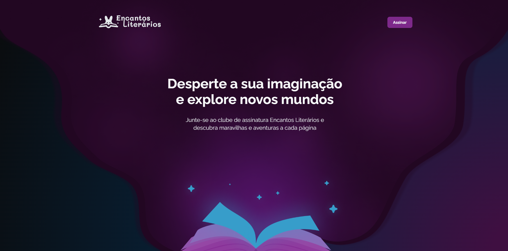

<h1> 🚀 Desafio prático - Encantos Literários</h1>

  

## ✨ Tecnologias

Esse projeto foi desenvolvido com as seguintes tecnologias:

- HTML e CSS
- Git e Github
- Figma

## 💥 Funcionalidades

- Animações de Hover: Efeitos de transição aplicados aos elementos quando o usuário passa o mouse sobre eles.
- Animações de Entrada: Elementos que ganham animações suaves ao entrar na página, proporcionando uma melhor experiência visual.

## 💡 Objetivo 

O objetivo central deste projeto é aprimorar as habilidades de animações CSS, para criar efeitos reativos e de alto desempenho, com foco na interação do usuário. 

## 💻 Projeto

Página web de clube de assinatura.
Este projeto foi realizado como um desafio prático no curso de Fullstack da Rocketseat na aula sobre animações, onde fui responsável por todo o desenvolvimento, aplicando os conhecimentos adquiridos ao longo das aulas.
